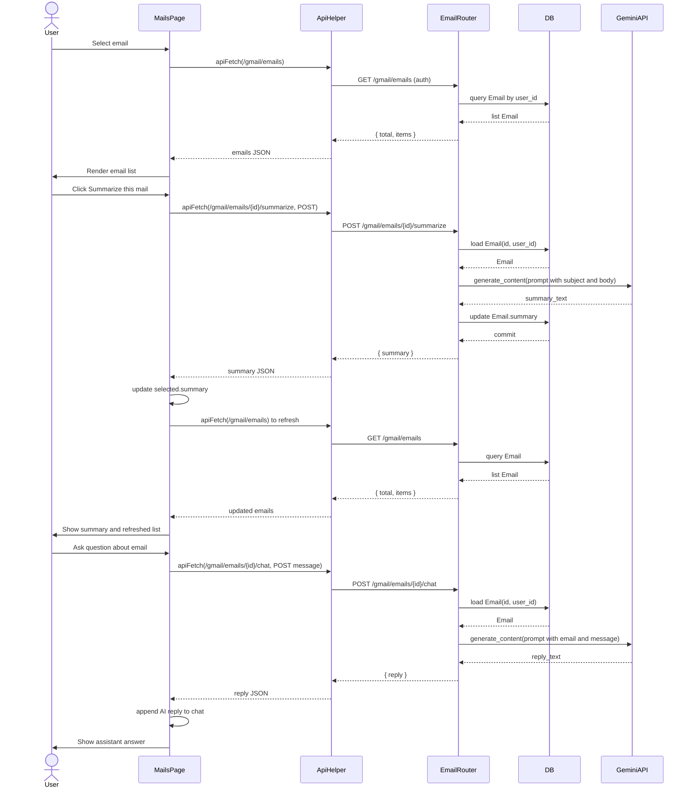
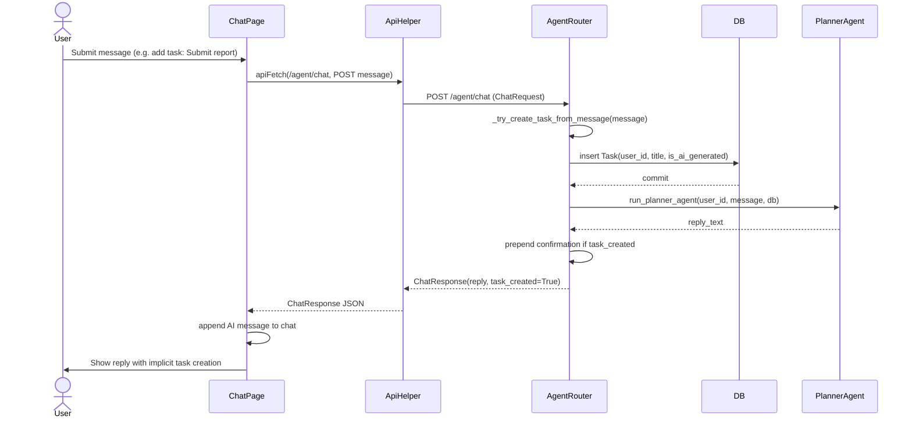
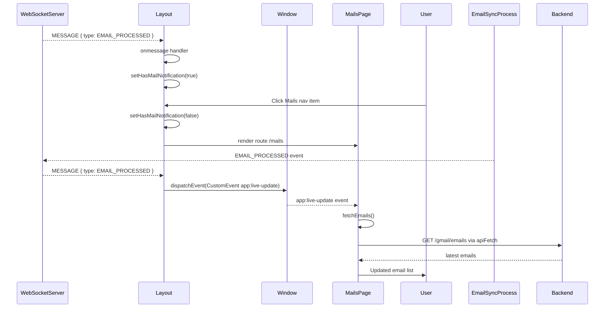
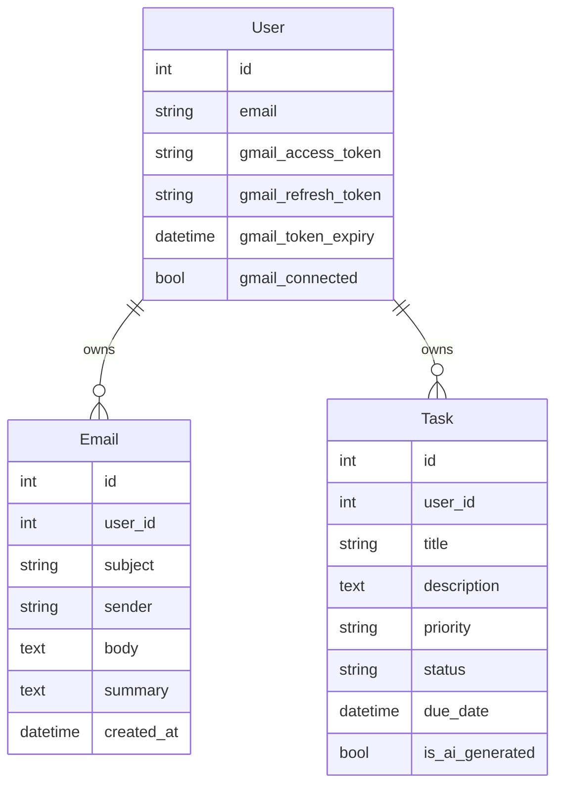
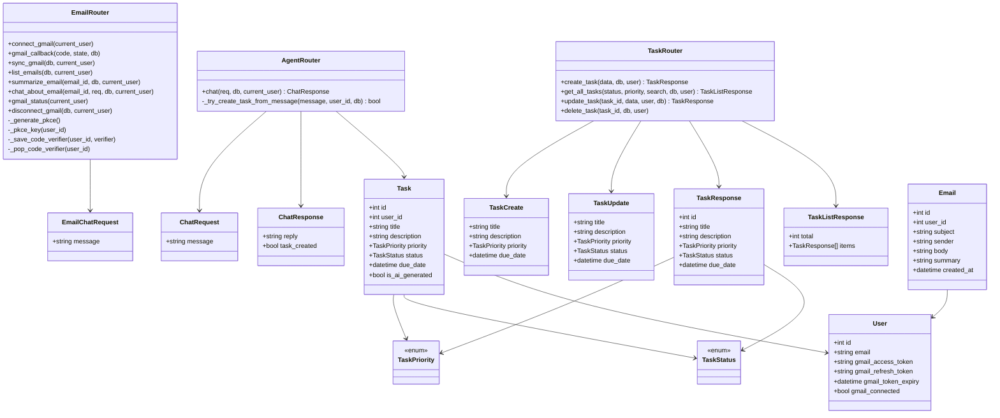

<!-- Generated by sourcery-ai[bot]: start review_guide -->

## Reviewer's Guide

Implements centralized client API helpers, adds Gmail inbox/summarization/chat capabilities with PKCE storage backed by Redis, introduces a mails UI with WebSocket-driven notifications, enhances agent chat to auto-create tasks from chat commands, and refactors task and Gmail APIs for safer, more consistent behavior and responses.

#### Sequence diagram for Gmail email summarization and chat

#### Sequence diagram for agent chat with auto task creation

#### Sequence diagram for WebSocket email processed notifications and mail refresh

#### Entity relationship diagram for users, emails, and tasks

#### Class diagram for updated email, agent, and task APIs

### File-Level Changes

| Change | Details | Files |
| ------ | ------- | ----- |
| Centralize client API and WebSocket URL construction and migrate existing fetch calls. | <ul><li>Added api.js with API_BASE_URL, apiFetch helper, and buildWebSocketUrl for protocol-aware WebSocket URLs.</li><li>Replaced hardcoded http://localhost:8000 fetch calls across App, Overview, TasksPage, ChatPage, and SettingsPage with apiFetch.</li><li>Updated Layout to construct WebSocket connections via buildWebSocketUrl instead of hardcoded ws://localhost:8000.</li></ul> | `client/src/api.js` `client/src/App.jsx` `client/src/pages/Overview.jsx` `client/src/pages/TasksPage.jsx` `client/src/pages/ChatPage.jsx` `client/src/pages/SettingsPage.jsx` `client/src/components/Layout.jsx` |
| Add Gmail inbox browsing, summarization, and email-centric chat endpoints and UI. | <ul><li>Extended Gmail API router to use Redis-backed PKCE storage with in-memory fallback for OAuth code verifiers.</li><li>Added /gmail/emails listing endpoint backed by Email model and ordered by created_at, plus /gmail/emails/{id}/summarize and /gmail/emails/{id}/chat routes using Gemini via google.generativeai.</li><li>Exposed /gmail/sync to run process_user_emails directly and adjusted callback error handling and disconnect behavior.</li><li>Created MailsPage UI to list emails, view details, trigger summarization, and chat about a selected email, including listening for app:live-update events.</li><li>Wired a new /mails route into the app and navigation with a notification badge driven by WebSocket EMAIL_PROCESSED messages.</li></ul> | `server/app/api/email.py` `client/src/pages/MailsPage.jsx` `client/src/App.jsx` `client/src/components/Layout.jsx` |
| Improve task API robustness and client UX for task operations. | <ul><li>Refactored task API imports and type usage to rely on schema enums for TaskStatus and TaskPriority and removed duplicate get_all_tasks definition.</li><li>Updated task listing to accept optional status, priority, and search query parameters with consistent TaskListResponse payload shape.</li><li>Hardened update_task to treat optional fields correctly (checking for None) and simplified status/priority validation by trusting Pydantic enums.</li><li>Kept delete_task and create_task behavior but standardized signatures, spacing, and error messages.</li><li>Enhanced TasksPage with loading and error states and migrated to apiFetch for all task operations.</li></ul> | `server/app/api/tasks.py` `client/src/pages/TasksPage.jsx` |
| Enhance agent chat to support task creation via chat commands and expose this in the schema and UI. | <ul><li>Added ChatResponse.task_created field in Pydantic schema with default False.</li><li>Introduced helper _try_create_task_from_message in agent API to parse "add/create task: <title>" commands via regex and conditionally create Task records marked is_ai_generated.</li><li>Modified /agent/chat to invoke the helper, wrap the agent reply with a confirmation prefix when a task is created, and return task_created in the API response.</li><li>Updated ChatPage to use apiFetch and surface inline network error messaging plus a tip describing the add task: pattern.</li></ul> | `server/app/api/agent.py` `server/app/schemas/agent.py` `client/src/pages/ChatPage.jsx` |
| Improve Gmail integration UX and status handling on the client side. | <ul><li>Updated SettingsPage to use apiFetch for Gmail status, connect, disconnect, and sync operations and added a statusMessage banner for user feedback.</li><li>On successful sync, dispatches a global app:live-update event with SYNC_COMPLETE so other views (e.g., MailsPage) can refresh.</li><li>Refined error handling for failed connect/disconnect/sync/status operations with user-visible messages instead of silent failures.</li></ul> | `client/src/pages/SettingsPage.jsx` |
| Add repository hygiene configuration. | <ul><li>Introduced a .gitignore with common Python, Node, and build artifacts to prevent committing generated files.</li></ul> | `.gitignore` |

---

Tips and commands

#### Interacting with Sourcery

- **Trigger a new review:** Comment `@sourcery-ai review` on the pull request.
- **Continue discussions:** Reply directly to Sourcery's review comments.
- **Generate a GitHub issue from a review comment:** Ask Sourcery to create an
  issue from a review comment by replying to it. You can also reply to a
  review comment with `@sourcery-ai issue` to create an issue from it.
- **Generate a pull request title:** Write `@sourcery-ai` anywhere in the pull
  request title to generate a title at any time. You can also comment
  `@sourcery-ai title` on the pull request to (re-)generate the title at any time.
- **Generate a pull request summary:** Write `@sourcery-ai summary` anywhere in
  the pull request body to generate a PR summary at any time exactly where you
  want it. You can also comment `@sourcery-ai summary` on the pull request to
  (re-)generate the summary at any time.
- **Generate reviewer's guide:** Comment `@sourcery-ai guide` on the pull
  request to (re-)generate the reviewer's guide at any time.
- **Resolve all Sourcery comments:** Comment `@sourcery-ai resolve` on the
  pull request to resolve all Sourcery comments. Useful if you've already
  addressed all the comments and don't want to see them anymore.
- **Dismiss all Sourcery reviews:** Comment `@sourcery-ai dismiss` on the pull
  request to dismiss all existing Sourcery reviews. Especially useful if you
  want to start fresh with a new review - don't forget to comment
  `@sourcery-ai review` to trigger a new review!

#### Customizing Your Experience

Access your [dashboard](https://app.sourcery.ai) to:
- Enable or disable review features such as the Sourcery-generated pull request
  summary, the reviewer's guide, and others.
- Change the review language.
- Add, remove or edit custom review instructions.
- Adjust other review settings.

#### Getting Help

- [Contact our support team](mailto:support@sourcery.ai) for questions or feedback.
- Visit our [documentation](https://docs.sourcery.ai) for detailed guides and information.
- Keep in touch with the Sourcery team by following us on [X/Twitter](https://x.com/SourceryAI), [LinkedIn](https://www.linkedin.com/company/sourcery-ai/) or [GitHub](https://github.com/sourcery-ai).

<!-- Generated by sourcery-ai[bot]: end review_guide -->
